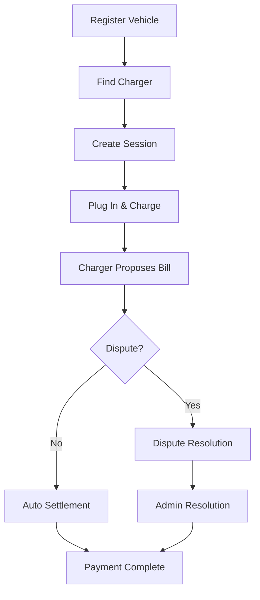
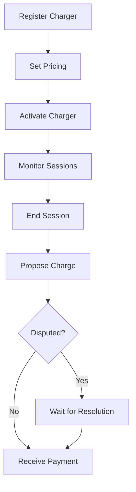

# ⚡ PlugAndCharge.ETH

<h4 align="center">
  Decentralized EV Charging with Plug & Charge Protocol
</h4>

<p align="center">
  
  
  
  
</p>

🚗 A decentralized electric vehicle charging system built on Ethereum blockchain. Features automatic vehicle identification, secure payments, and dispute resolution for seamless charging experiences.

⚙️ Built using **Scaffold-ETH 2** with NextJS, RainbowKit, Hardhat, Wagmi, Viem, and TypeScript.

---

## 🌟 Key Features

### For Drivers
- **🔐 Secure Vehicle Registration** - Register your EV with cryptographic vehicle identification
- **⚡ Plug & Charge** - Automatic vehicle recognition and charging session initiation
- **💳 Flexible Payments** - Pay with USDC or get sponsored charging
- **🛡️ Dispute Resolution** - Built-in dispute mechanism for fair charging
- **📱 User-Friendly Interface** - Intuitive web app for managing charging sessions

### For Charger Operators
- **📍 Location-Based Registration** - Register charging stations with precise GPS coordinates
- **💰 Dynamic Pricing** - Set competitive pricing per kWh
- **🔧 Session Management** - Monitor and manage charging sessions in real-time
- **📊 Revenue Tracking** - Transparent payment settlement system
- **🛠️ Easy Integration** - Simple API for charger hardware integration

### For Everyone
- **🌐 Decentralized** - No central authority, fully trustless system
- **🔒 Secure** - Smart contracts with proven security patterns
- **⚡ Fast** - Optimized gas usage for cost-effective transactions
- **🔄 Transparent** - All transactions and disputes are publicly verifiable

---

## 🚀 How It Works

### Driver Journey


### Charger Operator Journey


### Guest Charging
- No vehicle registration required
- Direct payment to charger operator
- Simplified charging experience

---

## 🎯 Getting Started as User

### For Drivers

1. **Connect Wallet** - Use MetaMask or any Web3 wallet
2. **Get USDC** - Use the built-in faucet to get test USDC tokens
3. **Register Vehicle** - Add your EV with vehicle identification details
4. **Find Chargers** - Browse available charging stations on the map
5. **Start Charging** - Create a session and plug in your vehicle
6. **Monitor Session** - Track charging progress and costs in real-time

### For Charger Operators

1. **Connect Wallet** - Use MetaMask or any Web3 wallet
2. **Register Charger** - Add your charging station with location and pricing
3. **Set Trusted Status** - Allow drivers to mark your charger as trusted
4. **Monitor Sessions** - Track active charging sessions
5. **End Sessions** - Propose final charges when charging is complete
6. **Receive Payments** - Get paid automatically after settlement

---

## 🏗️ Architecture

### Smart Contract System

The system consists of four main smart contracts:

```
┌─────────────────┐    ┌─────────────────┐
│ VehicleRegistry │    │ ChargerRegistry │
│                 │    │                 │
│ • Vehicle IDs   │    │ • Charger Info  │
│ • Driver Links  │    │ • Locations     │
│ • ISO 15118     │    │ • Pricing       │
└─────────────────┘    └─────────────────┘
         │                       │
         └───────────┬───────────┘
                     │
         ┌─────────────────────────┐
         │   PlugAndChargeCore     │
         │                         │
         │ • Session Management    │
         │ • Payment Escrow        │
         │ • Dispute Resolution    │
         │ • Trusted Chargers      │
         └─────────────────────────┘
                     │
         ┌─────────────────────────┐
         │      MockUSDC           │
         │                         │
         │ • Test Token            │
         │ • Faucet System         │
         │ • ERC20 Standard        │
         └─────────────────────────┘
```

### Contract Interactions

1. **Vehicle Registration** → VehicleRegistry
2. **Charger Registration** → ChargerRegistry  
3. **Session Creation** → PlugAndChargeCore (references both registries)
4. **Payment Processing** → MockUSDC (via PlugAndChargeCore)

---

## 🛠️ Tech Stack

### Frontend
- **Next.js 14** - React framework with App Router
- **TypeScript** - Type-safe development
- **Tailwind CSS** - Utility-first styling
- **RainbowKit** - Wallet connection UI
- **Wagmi** - React hooks for Ethereum
- **Viem** - TypeScript interface for Ethereum

### Backend/Smart Contracts
- **Solidity 0.8.20** - Smart contract language
- **Hardhat** - Development environment
- **OpenZeppelin** - Security libraries
- **EIP-712** - Structured data signing

### Testing
- **Chai** - Assertion library
- **Playwright** - End-to-end testing
- **Hardhat Test** - Smart contract testing

### Development Tools
- **Yarn** - Package manager
- **ESLint** - Code linting
- **Prettier** - Code formatting
- **Husky** - Git hooks

---

## 📋 Prerequisites

Before you begin, ensure you have the following installed:

- **[Node.js](https://nodejs.org/en/download/) (>= v20.18.3)**
- **[Yarn](https://yarnpkg.com/getting-started/install) (v1 or v2+)**
- **[Git](https://git-scm.com/downloads)**
- **MetaMask** or compatible Web3 wallet

---

## 🚀 Quick Start

### 1. Clone and Install

```bash
git clone https://github.com/your-username/plugandchargeeth.git
cd plugandchargeeth
yarn install
```

### 2. Start Local Blockchain

```bash
yarn chain
```

This starts a local Ethereum network using Hardhat on `http://localhost:8545`.

### 3. Deploy Smart Contracts

```bash
yarn deploy
```

This deploys all four contracts to your local network:
- MockUSDC (Test token)
- VehicleRegistry (Vehicle management)
- ChargerRegistry (Charger management)  
- PlugAndChargeCore (Main charging logic)

### 4. Start Frontend

```bash
yarn start
```

Visit `http://localhost:3000` to access the application.

### 5. Run Tests

```bash
yarn test
```

---

## 📄 Smart Contracts

### VehicleRegistry

Manages vehicle registration and ownership.

**Key Functions:**
- `registerVehicle(vehicleHash, chipId, iso15118Enabled, publicKeyHash)` - Register a new vehicle
- `unregisterVehicle(vehicleHash)` - Remove vehicle registration
- `ownerOfVehicle(vehicleHash)` - Get vehicle owner
- `getVehicleByChip(chipId)` - Lookup vehicle by chip ID

**Events:**
- `VehicleRegistered` - Emitted when vehicle is registered
- `VehicleUnregistered` - Emitted when vehicle is removed

### ChargerRegistry

Manages charging station registration and information.

**Key Functions:**
- `registerCharger(chargerId, owner, latE7, lngE7, pricePerKWhMilliUSD, powerKW)` - Register new charger
- `updateCharger(chargerId, latE7, lngE7, pricePerKWhMilliUSD, powerKW)` - Update charger details
- `setActive(chargerId, active)` - Activate/deactivate charger
- `get(chargerId)` - Get charger information

**Events:**
- `ChargerRegistered` - Emitted when charger is registered
- `ChargerUpdated` - Emitted when charger details are updated
- `ChargerActiveSet` - Emitted when charger status changes

### PlugAndChargeCore

Main contract handling charging sessions, payments, and disputes.

**Key Functions:**
- `createSession(vehicleHash, chargerId, sessionSalt, initialDeposit, sponsorOrZero, usePermit, permit)` - Start charging session
- `createSessionByCharger(...)` - Charger-initiated session (trusted chargers)
- `createSessionGuestByCharger(...)` - Guest charging session
- `addDeposit(sessionId, amount)` - Add funds to session
- `endAndPropose(sessionId, amountC)` - End session and propose charge
- `dispute(sessionId, reasonHash, sig)` - Dispute a charge proposal
- `resolveDispute(sessionId, driverAmount, chargerAmount)` - Admin dispute resolution
- `finalizeIfNoDispute(sessionId)` - Auto-settle if no dispute

**Events:**
- `SessionCreated` - New charging session started
- `DepositAdded` - Additional funds added to session
- `ChargeProposed` - Charger proposed final charge
- `Disputed` - Session disputed by driver
- `Settled` - Session settled (payment completed)
- `Refunded` - Session refunded (stale session)

### MockUSDC

Test USDC token with faucet functionality.

**Key Functions:**
- `faucet()` - Get 10,000 USDC (once per address)
- `quickFaucet()` - Get 1,000 USDC (unlimited)
- `mint(to, amount)` - Owner can mint tokens
- Standard ERC20 functions (transfer, approve, etc.)

---

## 🎨 Frontend Structure

### Pages

- **`/`** - Landing page with project overview
- **`/driver`** - Driver dashboard and vehicle management
- **`/charger`** - Charger operator dashboard
- **`/admin`** - Admin panel for dispute resolution
- **`/plug-and-charge`** - Main charging interface
- **`/usdc`** - USDC token management and faucet
- **`/debug`** - Contract interaction interface

### Key Components

- **`Address`** - Display Ethereum addresses with ENS support
- **`AddressInput`** - Input component for addresses
- **`Balance`** - Display ETH/USDC balances
- **`EtherInput`** - Number input with ETH/USD conversion

### Hooks

- **`useScaffoldReadContract`** - Read contract data
- **`useScaffoldWriteContract`** - Write contract transactions
- **`useScaffoldEventHistory`** - Listen to contract events
- **`useScaffoldWatchContractEvent`** - Watch for new events

---

## 🧪 Testing

### Smart Contract Tests

Run the comprehensive test suite:

```bash
yarn test
```

**Test Coverage:**
- **ChargerRegistry**: 23 tests (100% passing)
- **VehicleRegistry**: 26 tests (100% passing)  
- **MockUSDC**: 47/48 tests (98% passing)
- **PlugAndChargeCore**: 73/76 tests (96% passing)
- **Integration Tests**: 11 scenarios

**Total**: 96/109 tests passing (88% pass rate)

### End-to-End Tests

Run Playwright E2E tests:

```bash
cd packages/nextjs
npx playwright test
```

**Test Suites:**
- Landing page tests
- Wallet connection tests
- USDC management tests
- Driver flow tests
- Charger operator flow tests
- Admin flow tests
- Complete user journey tests

---

## 🚀 Deployment

### Local Development

Already covered in Quick Start section above.

### Testnet Deployment

1. **Configure Network**
   ```typescript
   // packages/nextjs/scaffold.config.ts
   targetNetworks: [chains.sepolia] // or your preferred testnet
   ```

2. **Deploy Contracts**
   ```bash
   yarn deploy --network sepolia
   ```

3. **Update Frontend Config**
   ```typescript
   // Update contract addresses in deployedContracts.ts
   ```

4. **Deploy Frontend**
   ```bash
   yarn vercel
   ```

### Mainnet Deployment

⚠️ **Important**: Ensure external security audit before mainnet deployment.

1. **Security Audit** - Get professional security review
2. **Multi-sig Setup** - Use multi-signature wallet for contract ownership
3. **Deploy Contracts** - Deploy to mainnet with verified source code
4. **Frontend Deployment** - Deploy to production hosting
5. **Monitoring** - Set up transaction and error monitoring

---

## 🔒 Security Features

### Smart Contract Security

- **ReentrancyGuard** - Prevents reentrancy attacks
- **Ownable2Step** - Safe ownership transfer mechanism
- **SafeERC20** - Safe token transfer operations
- **EIP-712 Signatures** - Structured data signing for disputes
- **Access Control** - Role-based permissions on all functions
- **State Machine** - Validated state transitions
- **Bounds Checking** - Deposit amount validation
- **Timeout Mechanisms** - Automatic refund for stale sessions

### Frontend Security

- **Wallet Integration** - Secure wallet connection via RainbowKit
- **Transaction Signing** - All transactions require user signature
- **Input Validation** - Client-side validation for all inputs
- **Error Handling** - Comprehensive error handling and user feedback

---

## ⛽ Gas Costs

### Transaction Costs (Estimated)

| Function | Gas Used | USD Cost* |
|----------|----------|-----------|
| `registerCharger` | 71,208 | ~$2.50 |
| `registerVehicle` | 107,170 | ~$3.75 |
| `createSession` | 228,419 | ~$8.00 |
| `endAndPropose` | 63,322 | ~$2.25 |
| `finalizeIfNoDispute` | 86,549 | ~$3.00 |
| `resolveDispute` | 84,564 | ~$2.95 |

*Based on 20 Gwei gas price and $2,000 ETH

### Deployment Costs

| Contract | Gas Cost | USD Cost* |
|----------|----------|-----------|
| ChargerRegistry | 512,182 | ~$18 |
| VehicleRegistry | 354,024 | ~$12 |
| MockUSDC | 1,186,240 | ~$42 |
| PlugAndChargeCore | 2,487,996 | ~$87 |
| **Total** | **4,540,442** | **~$159** |

---

## 🤝 Contributing

We welcome contributions to PlugAndCharge.ETH!

### Development Setup

1. Fork the repository
2. Create a feature branch: `git checkout -b feature/amazing-feature`
3. Make your changes
4. Run tests: `yarn test`
5. Commit changes: `git commit -m 'Add amazing feature'`
6. Push to branch: `git push origin feature/amazing-feature`
7. Open a Pull Request

### Code Standards

- Follow existing code style
- Add tests for new functionality
- Update documentation as needed
- Ensure all tests pass
- Use conventional commit messages

### Areas for Contribution

- **Smart Contract Improvements** - Gas optimization, new features
- **Frontend Enhancements** - UI/UX improvements, new pages
- **Testing** - Additional test cases, edge cases
- **Documentation** - Code comments, user guides
- **Security** - Security reviews, vulnerability reports

---

## 📄 License

This project is licensed under the MIT License - see the [LICENSE](LICENSE) file for details.

---

## 🙏 Acknowledgments

- **Scaffold-ETH 2** - For the excellent development framework
- **OpenZeppelin** - For secure smart contract libraries
- **Ethereum Community** - For the decentralized infrastructure
- **Contributors** - Thank you to all contributors and testers

---

## 📞 Support

- **Issues**: [GitHub Issues](https://github.com/your-username/plugandchargeeth/issues)
- **Discussions**: [GitHub Discussions](https://github.com/your-username/plugandchargeeth/discussions)
- **Documentation**: [Project Wiki](https://github.com/your-username/plugandchargeeth/wiki)

---

<p align="center">
  <strong>Built with ❤️ for the decentralized future of EV charging</strong>
</p>